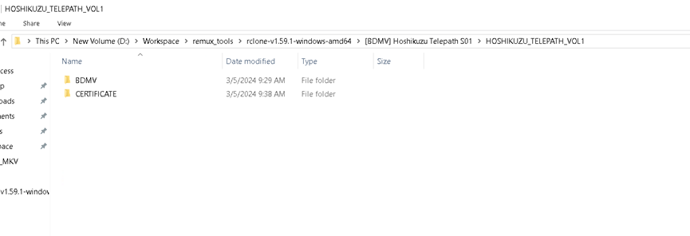
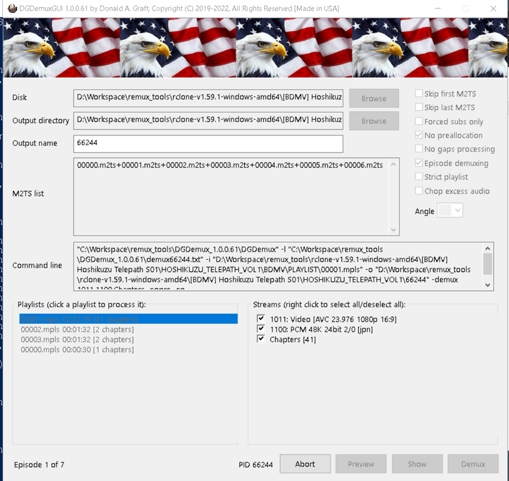
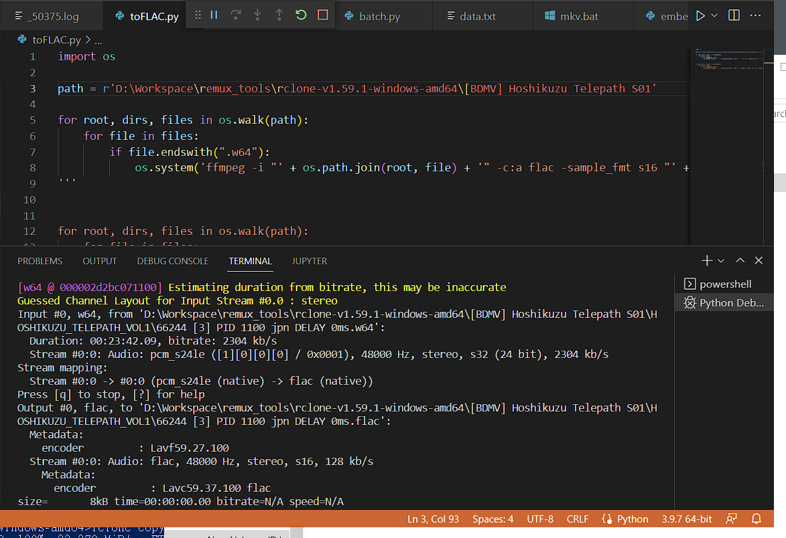
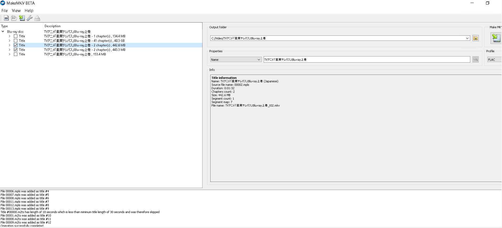

這是一個通過dgdemux , ffmpeg, mkvtoolnix, makemkv 來製作符合 本組 remux 標準的 "範例" 流程。

### 1.	整理分卷原盤文件結構
如使用dgdemux 路徑只能英文
```
[BDMV] Name S01
├── VOL_01
│   └── BDMV
└── VOL_02
    └── BDMV
```
 
 
### 2. 使用 dgdemux 來 demux 原盤

建議使用圖中的版本號，印象中後面有些版本有奇怪的bug

輸出在同目錄即可，記得勾選episode demuxing (如果是肉醬盤用這個也沒救)
 
 
### 3. Convert pcm to 16bits flac via ffmpeg (python script)
批量處理可參考 <https://github.com/010203le/343-remux-guide/blob/main/scripts/toFLAC.py>
 

### 4. 使用 mkvtoolnix 獲取第一集的封裝指令
(文件名可善用 nastool 識別測試功能，確保命名可被媒體庫識別，範例 Name S01E01-[1080p][JP.BD.Remux].mkv)

### 5. 將指令複製成多份，並將每行指令更改為不同集數對應文件
(輸出名、視訊軌文件、音軌文件、字幕文件、章節文件)

### 6. 建立bat檔並在末行加上 pause，以便跑完後查看log

### 7. 執行 bat 等待完成

### 8. 使用makemkv提取ncop/nced (如果沒有就不用了)
需事先修改makemkv設置
1. 最小標題長 30 秒
2. 開啟專家模式
3. 輸出預設 FLAC



### 9. 確認文件封裝正確、字幕時軸匹配

### 10. 建立種子
可使用qbittorrent 建立 僅v1種子 (勾選私人種子)

如要盒子發種，也可把數據傳輸到盒子後，使用mktorrent
mktorrent指令範例
```sh
mktorrent -v -p -l 24 -a http://tracker.example -o output.torrent "[BDRemux] Name S01"
```
